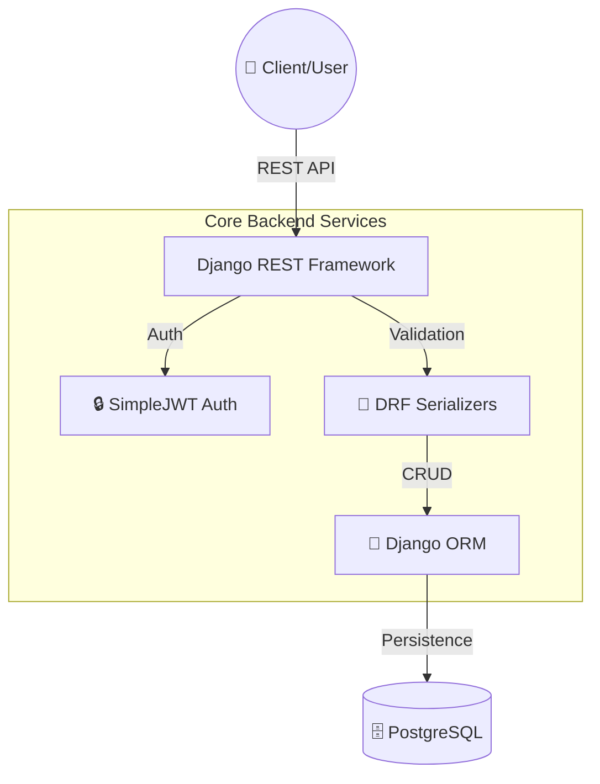
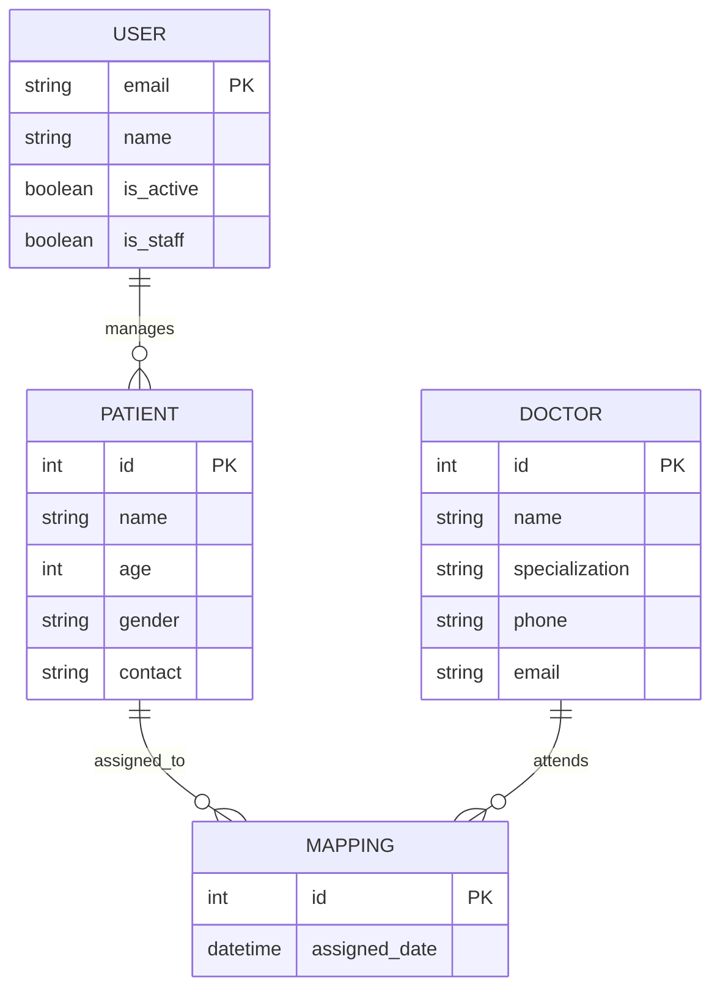
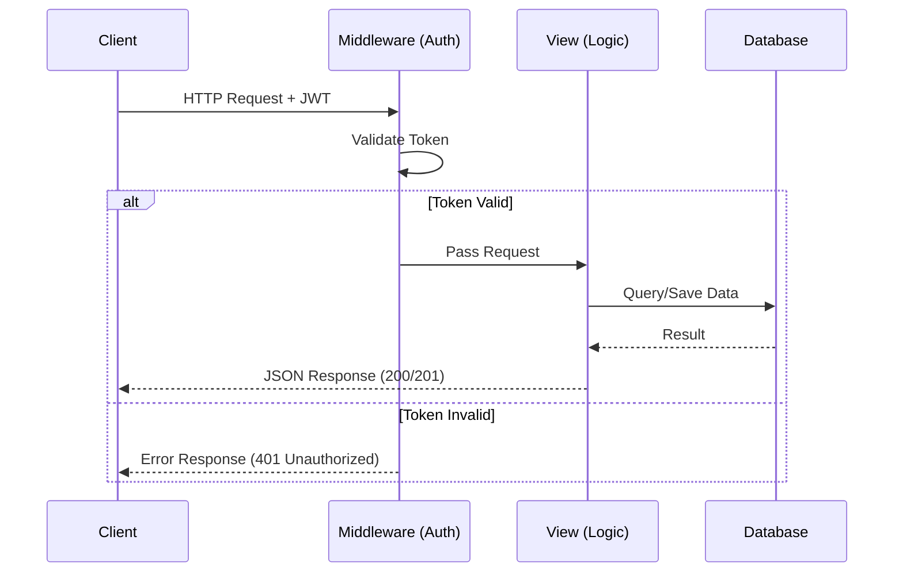

# 🏥 Healthcare Backend API

A robust and secure REST API designed for hospital staff, patient management, and doctor-patient relationship tracking.

---

## 🏗️ System Architecture




## Tech Stack
- Django
- Django REST Framework (DRF)
- PostgreSQL
- JWT (SimpleJWT)

## Project Structure
healthcare_backend/
├── api/
│   ├── models.py
│   ├── views.py
│   ├── serializers.py
│   ├── urls.py
├── healthcare_backend/
│   ├── settings.py
│   ├── urls.py
├── .env.example
├── requirements.txt
└── manage.py


---

## 📊 Database Schema




## Getting Started

### 1. Clone the repo
```bash
git clone <your-repo-url>
cd healthcare_backend
```

### 2. Create virtual environment
```bash
python -m venv venv
venv\Scripts\activate         # Windows
# source venv/bin/activate    # Mac/Linux
```

### 3. Install dependencies
```bash
pip install -r requirements.txt
```

### 4. Set up environment variables
Create a `.env` file in the root directory (tip: copy `.env.example`):
```text
SECRET_KEY=your_secret_key
DB_NAME=hospital_db
DB_USER=postgres
DB_PASSWORD=your_password
DB_HOST=localhost
DB_PORT=5432
```

### 5. Run migrations
```bash
python manage.py makemigrations
python manage.py migrate
```

### 6. Start the server
```bash
python manage.py runserver
```

## API Endpoints

### Auth
| Method | Endpoint | Description | Auth Required |
|--------|----------|-------------|---------------|
| POST | /api/auth/register/ | Register new user | No |
| POST | /api/auth/login/ | Login, returns JWT | No |

### Patients
| Method | Endpoint | Description | Auth Required |
|--------|----------|-------------|---------------|
| POST | /api/patients/ | Add a patient | Yes |
| GET | /api/patients/ | Get your patients | Yes |
| GET | /api/patients/<id>/ | Get one patient | Yes |
| PUT | /api/patients/<id>/ | Update patient | Yes |
| DELETE | /api/patients/<id>/ | Delete patient | Yes |

### Doctors
| Method | Endpoint | Description | Auth Required |
|--------|----------|-------------|---------------|
| POST | /api/doctors/ | Add a doctor | Yes |
| GET | /api/doctors/ | Get all doctors | Yes |
| GET | /api/doctors/<id>/ | Get one doctor | Yes |
| PUT | /api/doctors/<id>/ | Update doctor | Yes |
| DELETE | /api/doctors/<id>/ | Delete doctor | Yes |

### Patient-Doctor Mappings
| Method | Endpoint | Description | Auth Required |
|--------|----------|-------------|---------------|
| POST | /api/mappings/ | Assign doctor to patient | Yes |
| GET | /api/mappings/ | All mappings | Yes |
| GET | /api/mappings/patient/<patient_id>/ | Doctors for a patient | Yes |
| DELETE | /api/mappings/<id>/ | Remove mapping | Yes |

## Authentication

This project uses JWT for stateless auth. After logging in, include the token in your headers:
`Authorization: Bearer <your_access_token>`
---

### 🔄 Request Lifecycle



---

## 🧪 Testing

The project includes a robust testing suite.

### Standard Django Tests (Recommended)
Run these to verify the backend logic using isolated test databases:
```bash
python manage.py test api
```


## Notes
- Used a custom User model with `email` as the primary identifier.
- Patients are scoped to the user who created them (privacy first).
- Using a bridge table for mappings to keep the patient/doctor relationship clean.
